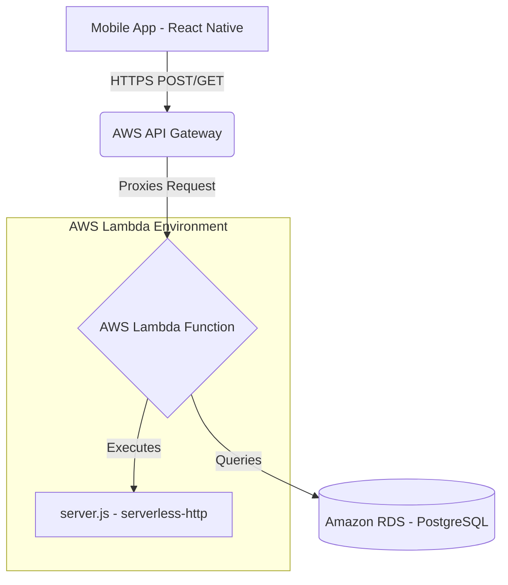

# Destow Application Architecture

This document defines the architecture of the Destow application, covering both the **AWS Infrastructure** (how it runs) and the **Internal Code Architecture** (how the code is structured).

---

## 1. AWS Serverless Infrastructure Architecture

The backend operates on a fully serverless AWS architecture, meaning there are no physical or virtual servers (like EC2) to manage.



### Components:
*   **AWS API Gateway (HTTP API):** Acts as the front door. It receives the HTTP requests from the React Native app and forwards them directly to Lambda.
*   **AWS Lambda:** Runs the Node.js backend (`server.js`). It spins up automatically when a request arrives and shuts down when finished, ensuring you only pay for compute time used.
*   **Amazon RDS (PostgreSQL):** The relational database storing agencies, cabs, and user data.

---

## 2. Application Code Architecture (`server.js`)

The actual Node.js application inside `destow-backend/server.js` is structured into 4 distinct layers:

### Layer 1: Configuration & Database Connection
*   **Express & CORS:** Sets up the API to accept JSON and allows cross-origin requests.
*   **PostgreSQL Pool (`pg`):** Establishes a connection to the database. It relies on environment variables (`DB_USER`, `DB_PASSWORD`, `DB_HOST`) so the code works both locally and on AWS without changes.

### Layer 2: Authentication (Auth Service)
Handles user onboarding and login.
*   `POST /auth/send-otp`: Accepts a phone number. *(Currently mocked, future integration: AWS SNS for real SMS).*
*   `POST /auth/verify-otp`: Verifies the code. *(Currently mocked to accept `123456`, returns a mocked JWT token).*

### Layer 3: Business Logic & Data Service
Serves dynamic data to the mobile application.
*   `GET /cabs`: Executes a `JOIN` SQL query to fetch a list of available cabs and their respective agency details from the database.
*   `GET /agencies`: Executes a `SELECT` query to fetch registered travel agencies.
*   `POST /booking`: Mock endpoint to confirm a ride.

### Layer 4: The Export Layer (AWS Bridge)
This allows the Express app to run natively in Serverless environments.
*   **`serverless-http` wrapper:** Instead of `app.listen()` occupying a port, the Express app is wrapped and exported as `module.exports.handler`. This translates AWS API Gateway events into standard Express `req` and `res` objects.

---

## 3. Data Architecture (Database Schema)

The PostgreSQL database relies on relational integrity between agencies and cabs:

```sql
-- Agencies Table
CREATE TABLE agencies (
    id SERIAL PRIMARY KEY,
    agency_name VARCHAR(255) NOT NULL,
    city VARCHAR(100) NOT NULL
);

-- Cabs Table
CREATE TABLE cabs (
    id SERIAL PRIMARY KEY,
    agency_id INTEGER REFERENCES agencies(id),
    vehicle_type VARCHAR(100) NOT NULL,
    description TEXT,
    driver_included BOOLEAN DEFAULT true,
    price_per_km DECIMAL NOT NULL
);
```

*When the mobile app requests `/cabs`, the backend joins these tables to provide a complete picture of the cab and the agency providing it.*

---

## 4. End-to-End API Flow (What happens when you click a button?)

When a user interacts with the app (e.g., clicking "Search Cabs"), here is the exact sequence of events defined through the APIs:

### Step 1: The UI Trigger (React Native)
The user clicks a button in the mobile app.
```javascript
// destow-mobile: App UI
<TouchableOpacity onPress={handleSearch}>
  <Text>Search Cabs</Text>
</TouchableOpacity>
```

### Step 2: The Network Request (Client API Call)
The `handleSearch` function makes an HTTP request to your AWS backend.
```javascript
// destow-mobile: API Call
const response = await fetch('https://your-api-gateway-url.com/cabs?from=Delhi&to=Chandigarh');
const data = await response.json();
```

### Step 3: AWS Routing (API Gateway -> Lambda)
1. The request hits **AWS API Gateway** over the internet.
2. API Gateway looks at the catch-all route (`ANY /{proxy+}`) defined in `cloudformation.yaml`.
3. It packages the HTTP request into an "event" and wakes up your **AWS Lambda function**.

### Step 4: Backend Processing (`server.js`)
Lambda feeds the event to `serverless-http`, which passes it to Express. Express finds the matching route.
```javascript
// destow-backend: server.js
app.get('/cabs', async (req, res) => {
  const { from, to } = req.query; // Extracts 'Delhi' and 'Chandigarh'
  
  // Step 5: Database Query
  const result = await pool.query('SELECT * FROM cabs ...');
  
  // Step 6: The Response
  res.json({ success: true, data: result.rows });
});
```

### Step 7: The UI Update (React Native)
The JSON response travels back through Lambda -> API Gateway -> Mobile App. The mobile app updates its "state", and the screen re-renders to show the cab cards!
```javascript
// destow-mobile: State Update
setCabs(data.data); // UI instantly updates to show the list of cabs
```
