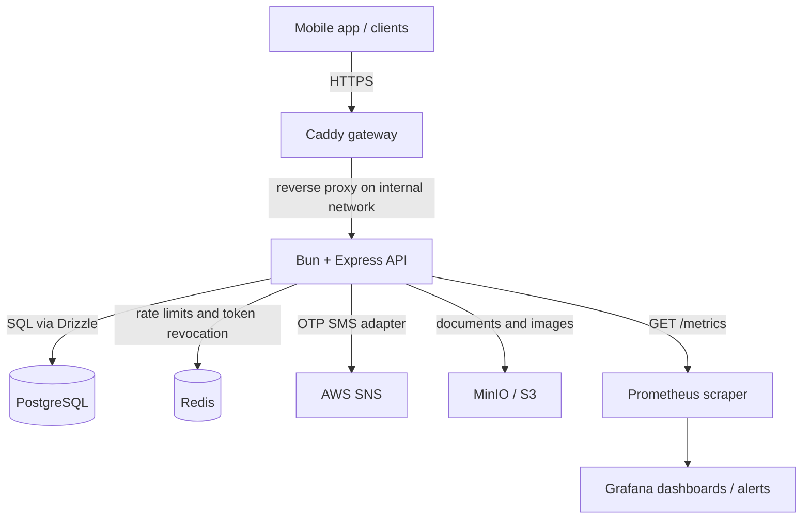

# Destow Architecture

Destow is an intercity cab and bus booking marketplace for India. The repository
is a Bun workspace monorepo with three main parts:

- `apps/api`: Bun + Express backend API.
- `apps/mobile`: Expo / React Native mobile app.
- `packages/contracts`: shared TypeScript contracts, enums, envelopes, and zod schemas.

The platform is designed as a modular monolith today, with clear internal
boundaries so features can be extracted later if needed.

## Runtime Topology



The gateway is the only public entry point. It terminates TLS, forwards requests
to the API on the internal network, preserves authorization headers, and allows
future WebSocket upgrades. The API is a long-running Bun process rather than a
serverless function so it can support planned real-time tracking.

PostgreSQL is the durable source of truth. Redis is used for rebuildable hot-path
state such as rate-limit counters and access-token revocation checks.

The API also exposes Prometheus-format metrics at `GET /metrics`. In production,
that endpoint should be reachable only by the observability network or scraper,
not by public clients.

## Monorepo Organization

```text
Destow/
|-- apps/
|   |-- api/
|   |   |-- src/
|   |   |   |-- config/          # validated environment configuration
|   |   |   |-- controllers/     # HTTP request/response orchestration
|   |   |   |-- db/              # Drizzle schema, migrations, pg and Redis clients
|   |   |   |-- lib/             # auth, adapters, pricing, HTTP helpers
|   |   |   |-- lib/metrics/     # Prometheus registry and metric definitions
|   |   |   |-- middleware/      # auth, rate limiting, request metrics
|   |   |   |-- services/        # business logic
|   |   |   +-- v1/              # versioned API routes
|   |   |-- Dockerfile
|   |   +-- docker-compose.yml
|   +-- mobile/
|       |-- app/                 # Expo Router screens and route groups
|       |-- components/          # reusable UI, cards, and form components
|       |-- constants/           # app runtime configuration
|       |-- data/                # current mock data fixtures
|       |-- services/            # API/mock service facade
|       |-- stores/              # Zustand app state
|       +-- theme/               # colors, spacing, typography
|-- packages/
|   +-- contracts/               # shared enums and zod contracts
|-- docs/
|-- Makefile
|-- package.json
+-- turbo.json
```

The root uses Bun workspaces and Turborepo. `bun.lock` is the single lockfile.
The Makefile wraps the common local workflow: validation, Docker stack startup,
migrations, tests, and mobile development.

## Backend Architecture

The API entry point is `apps/api/src/index.ts`. It creates the Express app,
configures CORS and JSON parsing, trusts one proxy hop from Caddy, installs
request metrics middleware, exposes health, JWKS, and metrics endpoints, mounts
versioned routes at `/api/v1`, and starts an HTTP server that can later host
WebSocket infrastructure.

Requests move through the backend in one direction:

```text
route -> middleware -> controller -> service -> db / Redis / adapter
```

- Routes in `src/v1` define endpoint paths and attach middleware.
- Controllers validate input, call services, and shape HTTP responses.
- Services own business rules, database work, token/session behavior, and adapter calls.
- Middleware handles cross-cutting concerns such as `requireAuth` and rate limiting.
- `lib/http` centralizes response envelopes, validation helpers, and error handling.
- `lib/adapters` isolates external providers for SMS, payments, and maps.
- `lib/pricing` computes fares and commissions.
- `lib/metrics` owns the Prometheus registry, default runtime metrics, and HTTP metrics.
- `db/schema.ts` defines the Drizzle schema and relations.

Current public v1 routes are auth-focused:

- `POST /api/v1/auth/request-otp`
- `POST /api/v1/auth/verify-otp`
- `POST /api/v1/auth/refresh`
- `POST /api/v1/auth/logout`
- `POST /api/v1/auth/logout-all`
- `GET /api/v1/auth/sessions`

## Observability

The backend includes Prometheus instrumentation through `prom-client`.
`apps/api/src/lib/metrics/metrics.ts` defines the registry and metrics, while
`apps/api/src/middleware/metrics/metrics.ts` records each completed HTTP request.

Current metrics include:

- Default Bun/Node process metrics with the `destow_` prefix, including CPU,
  heap, event loop, and runtime gauges provided by `prom-client`.
- `destow_http_requests_total`: request counter labeled by method, matched route,
  and status code.
- `destow_http_request_duration_seconds`: request latency histogram labeled by
  method, matched route, and status code.

The middleware intentionally labels by the matched route pattern instead of the
raw URL, which keeps metric cardinality bounded. It also skips `/metrics` so
Prometheus scrapes do not inflate normal request counters.

Operationally:

- `GET /health` remains the lightweight liveness check.
- `GET /metrics` is the scrape endpoint for Prometheus-compatible collectors.
- Application and gateway logs are still emitted to stdout/stderr and can be
  tailed locally through Docker Compose / `make logs`.
- In production, Caddy or the deployment network should restrict `/metrics` to
  internal observability infrastructure.

## Authentication And Sessions

Authentication is phone and OTP based. OTP request and verification endpoints are
protected by coarse per-IP rate limits, while the auth service owns the stricter
per-phone cooldowns, hourly caps, attempt tracking, and OTP hashing.

After OTP verification, the API issues:

- A short-lived EdDSA / Ed25519 JWT access token.
- A long-lived opaque refresh token stored only as a hash.

Refresh tokens rotate on use. Reuse of an already-used refresh token is treated
as theft and revokes the session family. Session revocation is stored durably in
PostgreSQL and checked quickly through Redis. Auth is fail-closed when Redis is
required but unavailable.

The API exposes `/.well-known/jwks.json` so public keys can be used to verify
access tokens without sharing private signing material.

## Data Model

The core tables are defined in `apps/api/src/db/schema.ts`:

- `users`: customers, providers, and admins.
- `service_providers`: fleet owners or agencies.
- `vehicle_types`: marketplace vehicle catalog.
- `vehicles`: provider inventory and per-kilometre rates.
- `drivers`: provider driver roster.
- `bookings`: customer trips with frozen fare and commission snapshots.
- `platform_settings`: commission and provider settings.
- `ratings`: post-trip feedback.
- `otps`: hashed OTP challenges.
- `sessions`, `refresh_tokens`, `auth_events`: auth state and audit trail.

Shared enum values come from `@destow/contracts`, which keeps the database,
backend, and client aligned on roles, statuses, payment states, trip types, and
vehicle categories.

## Money And Pricing

Backend pricing is server-authoritative. Money is represented as integer paise,
and distance is represented as integer metres. This avoids floating point errors
and prevents clients from setting their own fare.

Booking rows snapshot the selected vehicle rate, total fare, commission basis
points, commission amount, and provider payout. Historical bookings therefore do
not change when platform settings or provider prices change later.

## Mobile Architecture

The mobile app uses Expo Router. `apps/mobile/app/_layout.tsx` loads fonts,
controls the splash screen, sets the status bar, and defines the top-level route
groups:

- `(auth)`: splash, onboarding, login, signup, and OTP screens.
- `(tabs)`: primary tabbed app experience.
- `(booking)`: booking flow screens presented as a modal stack.

Reusable UI is organized under `components`, with separate folders for cards,
forms, and small UI primitives. Theme tokens live in `theme`.

State is managed with Zustand:

- `useAuthStore` tracks the current user, auth status, loading state, and pending OTP data.
- `useBookingStore` tracks city selection, date, passenger count, selected vehicle, distance, fare, and search state.
- `useAppStore` holds app-level UI state.

`services/api.ts` is currently a mock-backed service facade using fixture data
from `apps/mobile/data`. `constants/config.ts` already defines the intended API
base URL through `EXPO_PUBLIC_API_URL`, plus a `useMockData` switch. This gives
the app a single integration layer to replace or branch when real API calls are
enabled.

## Shared Contracts

`packages/contracts` is framework-agnostic and depends on zod. It exports:

- API response envelope helpers.
- Shared enum constants.
- Auth request schemas and inferred TypeScript types.

The backend consumes these schemas for validation and enum consistency. The
mobile app is expected to consume the same package for typed API calls as the
mock service layer is replaced with real network requests.

## Local Development

Common commands are wrapped by the root Makefile:

- `make validate`: check tooling, environment, and lockfile hygiene.
- `make env`: create the API environment file from the example.
- `make up`: start gateway, API, PostgreSQL, Redis, and MinIO.
- `make migrate`: run Drizzle migrations.
- `make mobile`: start the Expo dev server.
- `make test`: run unit tests.
- `make test-integration`: run auth/session integration tests against real services.
- `make ci`: run the local equivalent of CI.

The root package scripts delegate to Turborepo for workspace-level `build`,
`dev`, `lint`, and `start` tasks.

## Deployment

On pushes to `main`, the API container is built from `apps/api/Dockerfile` and
published to GHCR. The intended production runtime is a VPS or ECS-style
container host behind Caddy, with PostgreSQL, Redis, and object storage provided
as managed or containerized services depending on the environment.

## Architectural Principles

- Keep HTTP, business logic, persistence, and provider integrations in separate layers.
- Treat PostgreSQL as the source of truth and Redis as an accelerator.
- Keep contracts shared and typed instead of duplicating literals across apps.
- Compute price and commission on the server using integer units.
- Add feature modules under versioned routes without breaking existing clients.
- Keep the mobile app behind a service facade so mock data and real API calls can coexist during development.
