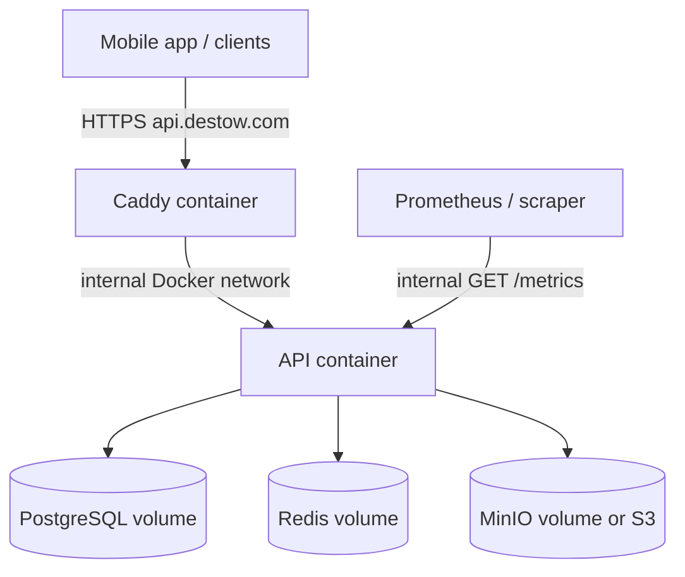

# Destow Deployment Guide

This guide explains what should run on a server, which hosting option is best
for the current stage, and how to deploy the project cheaply without painting
the architecture into a corner.

## Recommendation

For the MVP / early production stage, use a **single VPS with Docker Compose**.

It is cheaper, simpler, and fits this repo well because Destow already has:

- A containerized API in `apps/api/Dockerfile`.
- Caddy as the public gateway.
- PostgreSQL, Redis, and MinIO in `apps/api/docker-compose.yml`.
- A GitHub Actions workflow that already builds and pushes the API image to GHCR.

Use ECS later when you need managed autoscaling, private subnets, AWS-native
deployments, or a team that prefers AWS operations over simple server
administration.

## What To Deploy

Deploy the backend stack, not the Expo development app.

On the server:

- **Caddy gateway**: public entry point, HTTPS, reverse proxy, WebSocket-friendly.
- **API container**: Bun + Express app from `apps/api/Dockerfile`.
- **PostgreSQL**: durable application database.
- **Redis**: auth revocation denylist, rate limits, and future pub/sub.
- **Object storage**: MinIO for a cheap self-hosted start, or S3 for managed storage.
- **Observability**: use `apps/api/docker-compose.observability.yml` for
  Prometheus, Grafana, Loki, Alertmanager, and exporters.

Not on the backend server:

- **Mobile app**: build separately with Expo/EAS or native release pipelines.
- **Node/Bun dev server for mobile**: development only.
- **Test DB**: only for CI/integration tests.

## VPS vs ECS

| Option | Monthly shape | Good for | Tradeoff |
| --- | --- | --- | --- |
| VPS + Docker Compose | Usually around `$12-$30` for a useful 2-4 GB server, depending on provider | MVP, pilots, low traffic, simple ops | You manage OS updates, backups, firewall, monitoring |
| AWS Lightsail VPS | Predictable bundles; AWS lists Linux plans such as `$12/mo` for 2 GB RAM and `$24/mo` for 4 GB RAM | Cheap AWS-hosted VPS with simpler billing | Less flexible than full EC2/ECS |
| DigitalOcean Droplet | DO lists Basic Droplets at `$12/mo` for 2 GB RAM and `$24/mo` for 4 GB RAM | Simple VPS with friendly UI | Managed DB/Redis add cost |
| ECS Fargate | Compute is pay-per-vCPU/memory, but real setups usually also need ALB, logs, RDS, Redis, NAT/public IPv4, etc. | Scaling, AWS-native production, infra as code | More expensive and more complex for a small app |

Concrete cost intuition:

- A 24/7 ECS Fargate task with `1 vCPU + 2 GB` in us-east-1 is roughly `$35/mo`
  for x86 compute alone using AWS' published per-second example rates. ARM is
  lower, roughly `$28/mo` compute alone.
- An AWS Application Load Balancer example on the AWS pricing page is about
  `$22/mo` before the rest of the stack.
- Add RDS PostgreSQL, ElastiCache/Redis, CloudWatch logs, storage, snapshots,
  public IPv4, and data transfer, and ECS usually becomes a `$80-$150+/mo`
  architecture even for small traffic.

So: **start with VPS**, keep Docker images and environment variables clean, then
migrate to ECS when the business value is clear.

Sources checked July 13, 2026:

- AWS Fargate pricing: https://aws.amazon.com/fargate/pricing/
- AWS Elastic Load Balancing pricing: https://aws.amazon.com/elasticloadbalancing/pricing/
- AWS Lightsail pricing: https://aws.amazon.com/lightsail/pricing/
- DigitalOcean Droplet pricing: https://www.digitalocean.com/pricing/droplets

## Suggested MVP Server

Pick one:

- **Cheapest simple path**: Hetzner / DigitalOcean / Vultr style VPS, 2 vCPU, 4 GB RAM.
- **AWS-simple path**: AWS Lightsail, 4 GB RAM plan.
- **India latency path**: choose a provider with Mumbai/Bangalore/Chennai region if
  most users are in India. If not available, Singapore is usually a reasonable
  next hop.

Minimum for everything on one box:

- 2 vCPU.
- 4 GB RAM.
- 60+ GB SSD.
- Ubuntu LTS.
- Docker + Docker Compose.
- Automated daily database backups.

2 GB RAM can work for a tiny pilot, but PostgreSQL + Redis + MinIO + API +
gateway leaves little headroom. Use 4 GB if this is anything more than a demo.

## Production Layout On One VPS



Only Caddy should expose ports `80` and `443` publicly. The API, Postgres,
Redis, MinIO, and metrics endpoint should stay private to the server or Docker
network.

Observability can be added with the checked-in Compose add-on:

```bash
cd apps/api
docker compose -f docker-compose.yml -f docker-compose.observability.yml up -d
```

For VPS production, set `PROMETHEUS_CONFIG=./observability/prometheus.vps.yml`
and strong Grafana credentials in the Compose env file. Grafana and Prometheus
bind to `127.0.0.1` by default, so access them with an SSH tunnel unless you add
a protected Caddy vhost.

## Production Environment Variables

Required for the API:

```env
NODE_ENV=production
PORT=3000
DATABASE_URL=postgres://destow:<password>@db:5432/destow
DATABASE_SSL=disable
REDIS_URL=redis://redis:6379
JWT_SECRET=<32+ char OTP HMAC secret>
JWT_PRIVATE_KEY=<Ed25519 private key PEM or base64-PEM>
JWT_PUBLIC_KEY=<Ed25519 public key PEM or base64-PEM>
JWT_KID=prod-2026-01
JWT_ISSUER=destow
JWT_AUDIENCE=destow-app
CORS_ORIGINS=https://api.destow.com
AWS_REGION=ap-south-1
MAPS_API_KEY=<optional>
RAZORPAY_KEY_ID=<optional>
RAZORPAY_KEY_SECRET=<optional>
```

Production will not boot without `JWT_PRIVATE_KEY` and `JWT_PUBLIC_KEY`.

## VPS Deployment Plan

### 1. Prepare DNS

Create an `A` record:

```text
api.destow.com -> <server_public_ip>
```

Caddy will use this domain to issue and renew HTTPS certificates automatically.

### 2. Prepare The Server

On Ubuntu:

```bash
sudo apt update
sudo apt install -y ca-certificates curl git ufw
curl -fsSL https://get.docker.com | sudo sh
sudo usermod -aG docker $USER
```

Open only SSH and web traffic:

```bash
sudo ufw allow OpenSSH
sudo ufw allow 80/tcp
sudo ufw allow 443/tcp
sudo ufw enable
```

Log out and back in so Docker group membership applies.

### 3. Put Deployment Files On The Server

Recommended directory:

```bash
sudo mkdir -p /opt/destow
sudo chown -R $USER:$USER /opt/destow
cd /opt/destow
```

You can either clone the repo or copy only deployment files. For a simple first
deployment, clone the repo:

```bash
git clone https://github.com/<org>/<repo>.git .
```

### 4. Use A Production Compose File

Create `/opt/destow/docker-compose.prod.yml`:

```yaml
name: destow-prod

services:
  api:
    image: ghcr.io/<org>/<repo>/api:latest
    container_name: destow-api
    restart: unless-stopped
    depends_on:
      db:
        condition: service_healthy
      redis:
        condition: service_healthy
    env_file:
      - ./apps/api/.env.production
    networks:
      - destow

  gateway:
    image: caddy:2-alpine
    container_name: destow-gateway
    restart: unless-stopped
    depends_on:
      - api
    ports:
      - "80:80"
      - "443:443"
    volumes:
      - ./apps/api/Caddyfile.prod:/etc/caddy/Caddyfile:ro
      - caddy_data:/data
      - caddy_config:/config
    networks:
      - destow

  db:
    image: postgres:16-alpine
    container_name: destow-db
    restart: unless-stopped
    environment:
      POSTGRES_USER: destow
      POSTGRES_PASSWORD: ${POSTGRES_PASSWORD}
      POSTGRES_DB: destow
    volumes:
      - pgdata:/var/lib/postgresql/data
    healthcheck:
      test: ["CMD-SHELL", "pg_isready -U destow -d destow"]
      interval: 5s
      timeout: 3s
      retries: 10
    networks:
      - destow

  redis:
    image: redis:7-alpine
    container_name: destow-redis
    restart: unless-stopped
    command: redis-server --appendonly yes
    volumes:
      - redisdata:/data
    healthcheck:
      test: ["CMD", "redis-cli", "ping"]
      interval: 5s
      timeout: 3s
      retries: 10
    networks:
      - destow

  minio:
    image: minio/minio
    container_name: destow-minio
    restart: unless-stopped
    command: server /data --console-address ":9001"
    environment:
      MINIO_ROOT_USER: ${MINIO_ROOT_USER}
      MINIO_ROOT_PASSWORD: ${MINIO_ROOT_PASSWORD}
    volumes:
      - miniodata:/data
    networks:
      - destow

volumes:
  pgdata:
  redisdata:
  miniodata:
  caddy_data:
  caddy_config:

networks:
  destow:
```

Create `/opt/destow/apps/api/Caddyfile.prod`:

```caddyfile
api.destow.com {
  encode gzip

  @metrics path /metrics
  respond @metrics 404

  reverse_proxy api:3000
}
```

This keeps `/metrics` off the public internet. If you add Prometheus on the same
Docker network later, scrape `http://api:3000/metrics` internally.

### 5. Add Secrets

Create `/opt/destow/.env` for Compose-only secrets:

```env
POSTGRES_PASSWORD=<strong-db-password>
MINIO_ROOT_USER=<strong-minio-user>
MINIO_ROOT_PASSWORD=<strong-minio-password>
```

Create `/opt/destow/apps/api/.env.production` for API secrets:

```env
NODE_ENV=production
PORT=3000
DATABASE_URL=postgres://destow:<strong-db-password>@db:5432/destow
DATABASE_SSL=disable
REDIS_URL=redis://redis:6379
JWT_SECRET=<32+ char OTP HMAC secret>
JWT_PRIVATE_KEY=<private key>
JWT_PUBLIC_KEY=<public key>
JWT_KID=prod-2026-01
JWT_ISSUER=destow
JWT_AUDIENCE=destow-app
CORS_ORIGINS=*
AWS_REGION=ap-south-1
```

Lock down env files:

```bash
chmod 600 .env apps/api/.env.production
```

### 6. Pull And Start

```bash
docker login ghcr.io
docker compose --env-file .env -f docker-compose.prod.yml pull
docker compose --env-file .env -f docker-compose.prod.yml up -d
```

Check:

```bash
docker compose --env-file .env -f docker-compose.prod.yml ps
curl -fsS https://api.destow.com/health
```

### 7. Migrations

The current API Dockerfile runs `db:migrate` and `db:seed` before starting. That
is acceptable for a small first deployment if seed data is idempotent, but the
cleaner production pattern is:

1. Run migrations as a one-off deploy step.
2. Start the API with `bun src/index.ts`.
3. Do not run seed on every boot unless the seed script is strictly baseline and
   idempotent.

Before scaling past one instance, change the container command so multiple API
containers do not all try to migrate at the same time.

## GitHub Actions Rollout To VPS

`.github/workflows/deploy.yml` already builds and publishes the API image to
GHCR. Add a final SSH step after the push:

```yaml
- name: Deploy on VPS
  uses: appleboy/ssh-action@v1.0.3
  with:
    host: ${{ secrets.VPS_HOST }}
    username: ${{ secrets.VPS_USER }}
    key: ${{ secrets.VPS_SSH_KEY }}
    script: |
      cd /opt/destow
      docker login ghcr.io -u ${{ github.actor }} -p ${{ secrets.GITHUB_TOKEN }}
      docker compose --env-file .env -f docker-compose.prod.yml pull api
      docker compose --env-file .env -f docker-compose.prod.yml up -d api gateway
      docker image prune -f
```

Required GitHub secrets:

- `VPS_HOST`
- `VPS_USER`
- `VPS_SSH_KEY`

If the GHCR package is private, use a GitHub PAT with package read permission
instead of `GITHUB_TOKEN` for the server login.

## Backups

For cheap production, backups matter more than fancy orchestration.

Minimum:

- Nightly `pg_dump` to `/opt/destow/backups`.
- Copy backups off the server to S3, Cloudflare R2, Backblaze B2, or another VPS.
- Keep at least 7 daily and 4 weekly backups.
- Test restore monthly.

Example:

```bash
mkdir -p /opt/destow/backups
docker exec destow-db pg_dump -U destow -Fc destow > /opt/destow/backups/destow-$(date +%F-%H%M).dump
```

## When To Move To ECS

Move from VPS to ECS when at least one is true:

- You need horizontal API autoscaling.
- You need AWS-managed RDS, ElastiCache, IAM, VPC controls, and auditability.
- You need blue/green deployments with less manual server management.
- You have enough traffic or revenue that `$100+/mo` baseline infra is not painful.
- More than one engineer is operating production and repeatability matters more
  than simplicity.

Recommended ECS shape:

- ECS Fargate service for API tasks.
- ALB for HTTPS and health checks.
- RDS PostgreSQL for durable DB.
- ElastiCache Redis for revocation/rate limits.
- S3 for object storage.
- CloudWatch logs and metrics.
- AWS Secrets Manager or SSM Parameter Store for secrets.
- ECR instead of GHCR, or configure ECS to pull from GHCR carefully.

## Final Choice

For Destow right now:

1. Deploy the backend on a 4 GB VPS with Docker Compose.
2. Use Caddy for HTTPS.
3. Keep Postgres, Redis, and MinIO private.
4. Store daily off-server backups.
5. Keep building images through GitHub Actions.
6. Move to ECS after traffic and operational needs justify it.
