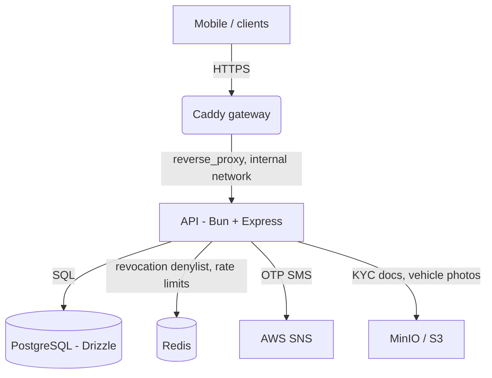
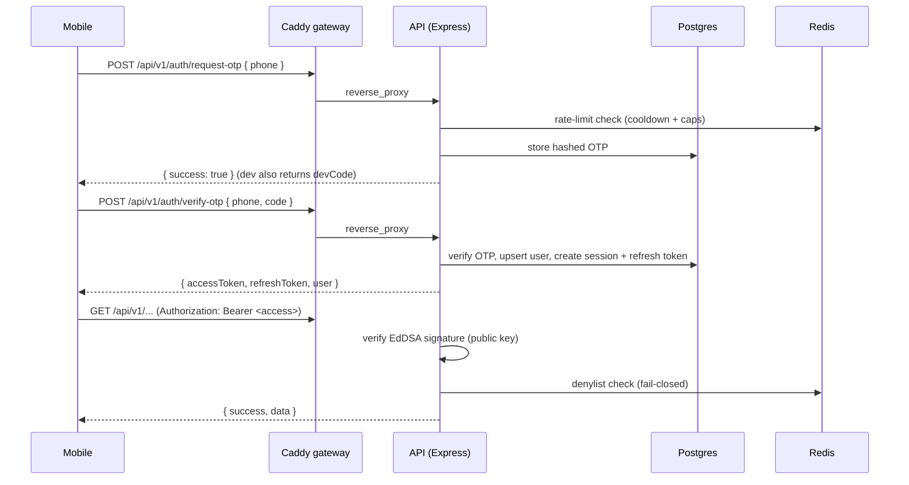

# Destow Application Architecture

How the Destow backend runs (infrastructure) and how the code is organised
(internal architecture). Destow is an intercity cab & bus booking marketplace;
this covers the API in `apps/api`.

---

## 1. Infrastructure

A single Caddy gateway is the only public entry point; the API is internal-only.
The API is a long-running Bun process (not a Lambda) so it can hold WebSocket
connections for the planned real-time tracking layer.



- **Caddy gateway:** the front door. Terminates TLS, forwards `Authorization`
  untouched, sets `X-Forwarded-For` (the API trusts one proxy hop so `req.ip` is
  the real client), and passes WebSocket upgrades through transparently.
- **API (Bun + Express):** runs the TypeScript directly (no build step). Not
  exposed to the host; only the gateway can reach it.
- **PostgreSQL (Drizzle ORM):** the source of truth — users, sessions, bookings,
  and the marketplace catalog.
- **Redis:** the auth revocation denylist and rate-limit counters (durable state
  lives in Postgres; Redis is a rebuildable accelerator).
- **AWS SNS / MinIO:** OTP SMS delivery (via a swappable adapter) and object
  storage for KYC/photos.

Deployment: on push to `main`, a container image is built (`apps/api/Dockerfile`)
and published to GHCR, then run on a VPS/ECS.

---

## 2. Code architecture

A layered **modular monolith**. Requests flow one direction; each layer has a
single job.

```
route (v1/<f>.route.ts)  ->  controller (controllers/<f>/)  ->  service (services/<f>/)  ->  db
        |                            |                                  |
   HTTP method/path            validate input,               business logic, transactions,
   + middleware                shape the response            Redis, adapters
```

- **`v1/`** — versioned route files; `v1/index.ts` mounts them at `/api/v1`.
- **`controllers/<feature>/`** — parse/validate the request, call a service,
  return the `{ success, data }` envelope.
- **`services/<feature>/`** — the business logic (DB access, Redis, adapters).
- **`middleware/`** — `auth` (JWT verify + denylist) and `ratelimit`.
- **`lib/`** — `auth` (Ed25519 keys/JWKS + jose sign/verify), `adapters`
  (sms/payments/maps, swappable by env), `pricing` (fare + commission engine),
  `http` (error handler, response envelope, zod validation).
- **`db/`** — Drizzle schema, migrations, the pg connection, and the Redis client.
- **`config/`** — a single zod-validated `env` module.

Shared enums and request/response schemas live in `packages/contracts` so the
API and (later) the mobile app agree on one contract.

---

## 3. Authentication

Phone + OTP, then a stateless-hybrid session:

- **Access token** — EdDSA (Ed25519) JWT, ~10 min, signed with a private key.
  Verified with the public key (served at `/.well-known/jwks.json`), so the
  gateway or other services can validate without calling the API.
- **Refresh token** — opaque random bytes, hashed in Postgres, ~60 days,
  **rotated** on every use. Presenting an already-used refresh token is treated
  as theft and revokes the whole session family (reuse detection).
- **Revocation** — a Redis denylist keyed by session id kills a token
  immediately on logout/ban; `requireAuth` checks it on the hot path. It is
  **fail-closed**: if Redis is unreachable, auth returns 503 rather than
  honouring a possibly-revoked token.

OTP codes are stored HMAC-hashed (never plaintext), single-active-per-phone,
with attempt lockout and Redis-backed rate limiting (per-phone cooldown + hourly
caps and a per-IP backstop).

---

## 4. Money & pricing

All money is integer **paise** and distance is integer **metres** — no floats
ever touch money. A single server-side engine computes the fare and commission
(`total = price_per_km * distance`, commission clamped to 15-20%), so the client
can never set its own price. The fare is snapshotted onto a booking at creation,
so later config changes never rewrite history.

---

## 5. Data model (key tables)

```
users(id, phone, name, role, status, ...)
sessions(id, user_id, device, ip, expires_at, revoked_at, ...)
refresh_tokens(id, session_id, token_hash, used_at, expires_at)
auth_events(id, user_id, session_id, event, ...)          -- audit trail

service_providers(id, owner_user_id, status, commission_bps_override, rating_*)
vehicle_types(id, category, name, seats, ...)
vehicles(id, service_provider_id, vehicle_type_id, price_per_km_paise, status)
drivers(id, service_provider_id, name, phone, status)
bookings(id, customer_user_id, vehicle_id, distance_m,
         price_per_km_paise, total_fare_paise, commission_paise,      -- frozen snapshot
         provider_payout_paise, status, payment_status, ...)
ratings(id, booking_id, service_provider_id, rating, comment)
platform_settings(id, commission_bps, ...)
otps(id, phone, code_hash, expires_at, attempts, consumed_at)
```

---

## 6. End-to-end request flow (login)



The middleware verifies the token's signature and checks the Redis denylist with
no database hit; the role travels in the token and is re-minted fresh on every
refresh.
