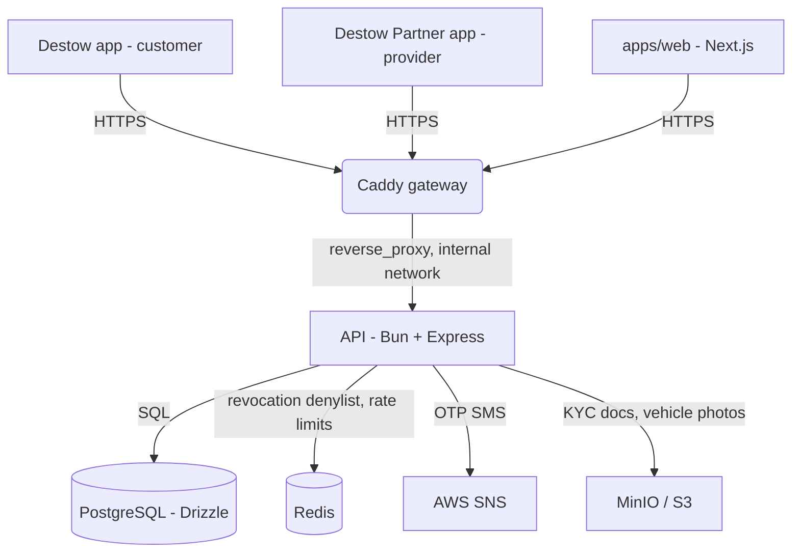
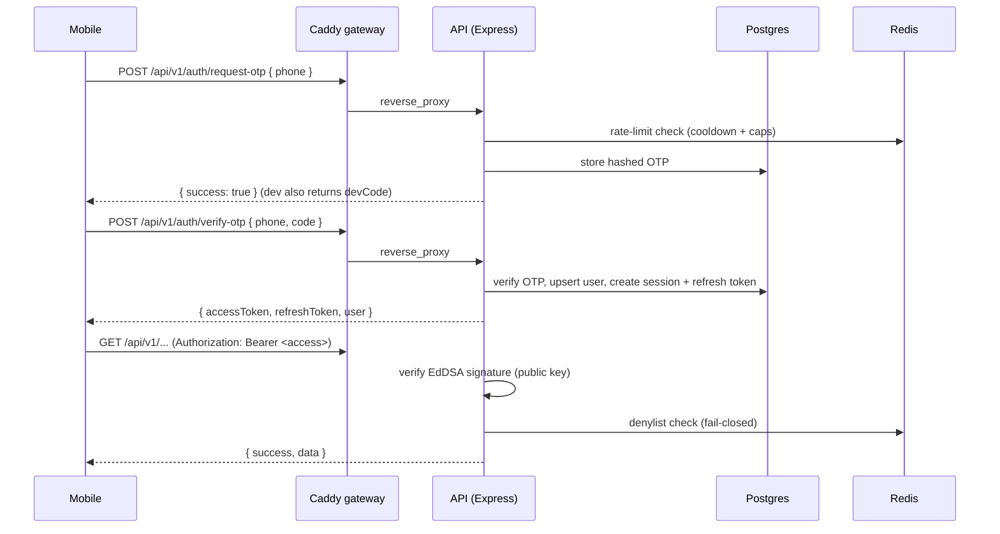

# Destow Application Architecture

How the Destow backend runs (infrastructure) and how the code is organised
(internal architecture). Destow is an intercity cab & bus booking marketplace;
this covers the API in `apps/api`.

Two product rules shape the backend and are assumed throughout this document:
every vehicle is priced **per kilometre** (buses are chartered whole, never sold
by the seat), and a booking is fulfilled by **instant dispatch** — the server
assigns a pre-committed vehicle and driver when the customer confirms, rather
than offering the job to a queue of providers.

---

## 1. Infrastructure

A single Caddy gateway is the only public entry point; the API is internal-only.
The API is a long-running Bun process (not a Lambda) so it can hold WebSocket
connections for the planned real-time tracking layer.



- **Caddy gateway:** the front door. Terminates TLS, forwards `Authorization`
  untouched, sets `X-Forwarded-For` (the API trusts one proxy hop so `req.ip` is
  the real client), and passes WebSocket upgrades through transparently.
- **API (Bun + Express):** runs the TypeScript directly (no build step). Not
  exposed to the host; only the gateway can reach it.
- **PostgreSQL (Drizzle ORM):** the source of truth — users, sessions, bookings,
  and the marketplace catalog.
- **Redis:** the auth revocation denylist and rate-limit counters (durable state
  lives in Postgres; Redis is a rebuildable accelerator).
- **AWS SNS / MinIO:** OTP SMS delivery (via a swappable adapter) and object
  storage for KYC/photos.

Three clients share this one API:

- **Destow** (`apps/mobile`, Expo) — the customer app.
- **Destow Partner** — the provider app, a separate install with its own entry
  and account, serving both the solo owner-driver and the fleet agency.
- **`apps/web`** (Next.js) — the marketing site now; the internal admin dashboard
  later, in the same app.

Deployment: on push to `main`, a container image is built (`apps/api/Dockerfile`)
and published to GHCR, then run on a VPS/ECS.

---

## 2. Code architecture

A layered **modular monolith**. Requests flow one direction; each layer has a
single job.

```
route (v1/<f>.route.ts)  ->  controller (controllers/<f>/)  ->  service (services/<f>/)  ->  db
        |                            |                                  |
   HTTP method/path            validate input,               business logic, transactions,
   + middleware                shape the response            Redis, adapters
```

- **`v1/`** — versioned route files; `v1/index.ts` mounts them at `/api/v1`.
- **`controllers/<feature>/`** — parse/validate the request, call a service,
  return the `{ success, data }` envelope.
- **`services/<feature>/`** — the business logic (DB access, Redis, adapters).
- **`middleware/`** — `auth` (JWT verify + denylist) and `ratelimit`.
- **`lib/`** — `auth` (Ed25519 keys/JWKS + jose sign/verify), `adapters`
  (sms/payments/maps, swappable by env), `pricing` (fare + commission engine),
  `http` (error handler, response envelope, zod validation).
- **`db/`** — Drizzle schema, migrations, the pg connection, and the Redis client.
- **`config/`** — a single zod-validated `env` module.

Shared enums and request/response schemas live in `packages/contracts` so the
API and (later) the mobile app agree on one contract.

---

## 3. Authentication

Phone + OTP, then a stateless-hybrid session:

- **Access token** — EdDSA (Ed25519) JWT, ~10 min, signed with a private key.
  Verified with the public key (served at `/.well-known/jwks.json`), so the
  gateway or other services can validate without calling the API.
- **Refresh token** — opaque random bytes, hashed in Postgres, ~60 days,
  **rotated** on every use. Presenting an already-used refresh token is treated
  as theft and revokes the whole session family (reuse detection).
- **Revocation** — a Redis denylist keyed by session id kills a token
  immediately on logout/ban; `requireAuth` checks it on the hot path. It is
  **fail-closed**: if Redis is unreachable, auth returns 503 rather than
  honouring a possibly-revoked token.

OTP codes are stored HMAC-hashed (never plaintext), single-active-per-phone,
with attempt lockout and Redis-backed rate limiting (per-phone cooldown + hourly
caps and a per-IP backstop).

---

## 4. Money & pricing

All money is integer **paise** and distance is integer **metres** — no floats
ever touch money. A single server-side engine computes the fare and commission
(`total = price_per_km * distance`, commission clamped to 15-20%), so the client
can never set its own price. The fare is snapshotted onto a booking at creation,
so later config changes never rewrite history.

**One rate mechanism, two rate cards.** Every vehicle class — hatchback through
45-seat coach — is priced per kilometre; buses are chartered whole, so there is
no per-seat path anywhere in the pricing engine. A trip is either `one_way` or
`up_down`, and each carries its **own** `price_per_km`:

| Trip type | Billed distance | Why the rate differs |
| --- | --- | --- |
| `one_way` | Route distance | Must absorb the empty return run |
| `up_down` | Route distance × 2 | Paying passenger both legs, so cheaper per km |

Illustrative sedan rates: one-way ₹16/km (268 km → ₹4,288); up-down ₹14/km
(536 km → ₹7,504). Charging a single rate across both types under-pays the
operator on one-way trips, which is why the rate is per trip type rather than
per vehicle alone.

**The customer pays no platform fee.** Commission is taken from the provider's
settlement on completed bookings only, and never appears in the customer's fare
breakdown.

### 4.1 Distance metering

**The customer is shown the rate, never a total, until the journey ends.** The
fare is computed at trip completion from the distance actually travelled, and
presented with its arithmetic on a journey-summary screen before payment.

That makes the distance measurement a trust-critical path, so it is built to be
resistant to the provider inflating it:

**The booked route is an indication, not a contract on distance.** Billing is a
metre: `fare = price_per_km × kilometres actually driven`. There is no concept of
"extra distance" needing approval, and no planned-versus-actual reconciliation.

- Book Delhi → Chandigarh but get out at Panipat, and you pay for the ~90 km
  driven, not the 243 km booked.
- Carry on past Chandigarh and the further kilometres bill at the same ₹/km.
- **Continuing beyond the booked drop is the driver's decision.** They may
  decline, and declining must not affect their rating.

1. **Planned distance is server-computed, and used for the estimate and for
   dispatch — not for the bill.** At booking the maps adapter returns the route
   distance; it is frozen as `distance_planned_m` so the customer sees a
   realistic route length and dispatch can match a suitable vehicle. The
   provider has no input to it, the same rule as the fare engine.
2. **The whole journey is tracked.** The partner app posts a GPS ping every
   15-30 s over the Socket.io layer, buffered on device and flushed on reconnect
   so tunnels and rural dead zones do not lose the trace.
3. **Distance comes from map-matching, never from summing raw pings.** Raw GPS
   sums run 5-15% high because per-point error accumulates as phantom distance —
   idling at a toll booth alone can add a kilometre. The trace is snapped to the
   road network (OSRM / Valhalla / Google Roads) and the road distance of the
   matched path is the measurement. Gaps are interpolated along the planned
   route, not straight-lined across.
4. **Two traces, not one.** The passenger's app is open for live tracking, so
   the customer's trace is recorded alongside the driver's. The provider would
   inflate and the passenger would deflate, so agreement between them is strong
   evidence and divergence is a flag rather than a word-against-word dispute.
5. **Plausibility checks.** Reject pings implying >150 km/h; read Android's
   mock-location flag. Because the matched path must be a continuous, drivable
   road route at real speeds, distance cannot be fabricated — only genuinely
   driven. Deliberate long-hauling therefore shows up as a measurable divergence
   from the best available route.

A different route than planned is normal and expected — traffic, roadworks, a
closed highway. It is the *comparison* between the driven path and the best
route, not the fact of deviation, that matters.

Both traces are retained as the audit trail behind the invoice.

Because the fare follows the metre, the customer's protection against a padded
route is **visibility during the trip, not a cap after it**: the live trip screen
shows kilometres accumulating in real time, so a detour is apparent while it is
happening rather than arriving as a surprise on the invoice. Divergence between
the driven path and the best route between the actual start and end points is a
review flag, backed by both stored traces.

### 4.2 Payment

**Payment is collected at the end of the trip, not at booking** — the journey
summary shows the metered amount, and the customer then settles it. Two ways,
both at drop-off:

- **In-app** — UPI (Google Pay / PhonePe / UPI ID) or card, paid to DESTOW.
- **Cash** — handed directly to the driver.

For a cash trip the operator has already received the full fare, so DESTOW's
commission on it is recovered from the operator's *next* settlement rather than
paid out — the settlement screen shows cash-collected fares deducted from the
payout for exactly this reason.

**Cancellation is free, with no fee.** Because nothing is collected until a trip
is completed, a cancelled booking has nothing to refund and costs the customer
nothing — the cancel screen states this plainly rather than showing a refund
breakdown.

> Payment *security* (the risk of a customer walking away from an in-app amount
> that is only known at trip end) is not separately mitigated: cash removes it
> for cash trips, and an unpaid in-app balance blocks the account from booking
> again. A capped UPI Autopay mandate at booking remains an option if walk-away
> turns out to be a real problem in practice.

---

## 5. Data model (key tables)

```
users(id, phone, name, role, status, ...)
sessions(id, user_id, device, ip, expires_at, revoked_at, ...)
refresh_tokens(id, session_id, token_hash, used_at, expires_at)
auth_events(id, user_id, session_id, event, ...)          -- audit trail

service_providers(id, owner_user_id, status, commission_bps_override, rating_*)
vehicle_types(id, category, name, seats, ...)                 -- hatchback .. 45-seat coach
vehicles(id, service_provider_id, vehicle_type_id, status,
         price_per_km_one_way_paise, price_per_km_up_down_paise,     -- a rate per trip type
         permit_expires_on, insurance_expires_on)                    -- Motor Vehicles Act
drivers(id, service_provider_id, name, phone, status, licence_expires_on)

provider_routes(id, service_provider_id, origin, destination, distance_m, active)
vehicle_availability(id, vehicle_id, provider_route_id,
                     starts_at, ends_at, driver_id)          -- what dispatch selects from

bookings(id, customer_user_id, vehicle_id, driver_id, trip_type,      -- one_way | up_down
         distance_m,                                                  -- doubled for up_down
         price_per_km_paise, total_fare_paise, commission_paise,      -- frozen snapshot
         provider_payout_paise, status, payment_status, ...)
ratings(id, booking_id, service_provider_id, rating, comment)
platform_settings(id, commission_bps, ...)
otps(id, phone, code_hash, expires_at, attempts, consumed_at)
```

Three things follow from instant dispatch:

- **`vehicle_availability` is what makes a booking possible.** A vehicle is only
  bookable on a route it has declared, in a window where it is free. Dispatch
  selects a row here and writes `vehicle_id` + `driver_id` onto the booking in
  the same transaction that creates it — so a confirmed booking always has a
  driver, and there is no pending state to reconcile.
- **Compliance gates supply.** A vehicle whose `permit_expires_on` or
  `insurance_expires_on` has passed, or a driver with a lapsed licence, must be
  excluded from dispatch. Expiry is a supply-side blocker, not a warning.
- **`trip_type` is frozen on the booking** alongside the rate, because the two
  rate cards mean the same route bills differently depending on it.

---

## 6. End-to-end request flow (login)



The middleware verifies the token's signature and checks the Redis denylist with
no database hit; the role travels in the token and is re-minted fresh on every
refresh.
