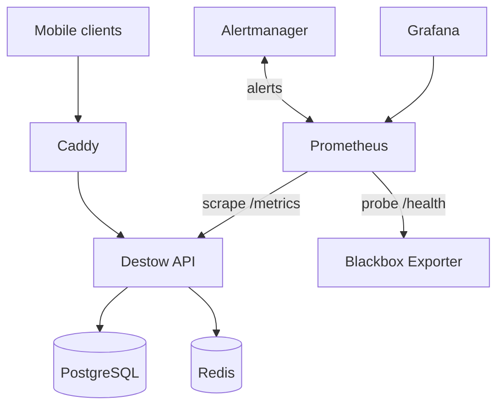

# Lightweight Observability For Destow

Destow already exposes the most important production signal: API metrics at
`GET /metrics` using `prom-client`. The checked-in observability stack keeps that
signal easy to operate without adding host-level exporters, Docker socket access,
or log storage services.

## What Is Included

The deployable files live under `apps/api`:

- `docker-compose.observability.yml`: Prometheus, Grafana, Alertmanager, and
  Blackbox Exporter.
- `observability/prometheus.local.yml`: local scrape config.
- `observability/prometheus.vps.yml`: production scrape config.
- `observability/alert-rules.yml`: API-focused alert rules.
- `observability/alertmanager.yml`: quiet default alert routing.
- `observability/blackbox.yml`: HTTP health-check probe module.
- `observability/grafana/provisioning/datasources/datasources.yml`: automatic
  Prometheus data source.
- `observability/grafana/provisioning/dashboards/dashboards.yml`: automatic
  dashboard provider.
- `observability/grafana/dashboards/destow-api-overview.json`: API overview
  dashboard.
- `.env.observability.example`: optional local/VPS overrides.

This is intentionally small. It gives you request rate, error rate, latency,
runtime/process metrics, internal scrape health, public health checks, dashboards,
and alert routing.

## Local Deploy

From the repo root:

```bash
make obs-up
```

This runs:

```bash
cd apps/api
docker compose -f docker-compose.yml -f docker-compose.observability.yml up -d
```

Local URLs:

- API: `http://localhost:3000/health`
- Grafana: `http://localhost:3001`
- Prometheus: `http://localhost:9090`

Default local Grafana credentials:

```text
admin / destow_admin_change_me
```

Change them by copying values from `apps/api/.env.observability.example` into
`apps/api/.env`.

Useful local commands:

```bash
make obs-ps
make obs-logs
make obs-down
```

## VPS Deploy

Set production overrides in the VPS Compose env file:

```env
PROMETHEUS_CONFIG=./observability/prometheus.vps.yml
GRAFANA_ADMIN_USER=admin
GRAFANA_ADMIN_PASSWORD=<strong-password>
```

Then start the production stack from `apps/api`:

```bash
docker compose \
  --env-file .env \
  -f docker-compose.yml \
  -f docker-compose.observability.yml \
  up -d
```

Grafana and Prometheus are bound to `127.0.0.1` by default, so on a VPS use an
SSH tunnel:

```bash
ssh -L 3001:localhost:3001 -L 9090:localhost:9090 user@server
```

Then open:

- Grafana: `http://localhost:3001`
- Prometheus: `http://localhost:9090`

For public Grafana access, put it behind Caddy with HTTPS and basic auth. Do not
publicly expose Prometheus, Alertmanager, Blackbox Exporter, or API `/metrics`.

## Stack Shape



## Production Signals

From `apps/api/src/lib/metrics/metrics.ts`:

- `destow_http_requests_total`
- `destow_http_request_duration_seconds`
- `destow_auth_events_total`
- `destow_rate_limit_events_total`
- `destow_db_queries_total`
- `destow_db_query_duration_seconds`
- `destow_redis_commands_total`
- `destow_redis_command_duration_seconds`
- `destow_external_requests_total`
- `destow_external_request_duration_seconds`
- `destow_payment_events_total`
- `destow_booking_events_total`
- `destow_provider_assignment_events_total`
- `destow_postgres_pool_connections`
- `destow_bookings_total`
- `destow_booking_total_fare_paise`
- `destow_booking_commission_paise`
- `destow_providers_total`
- `destow_vehicles_total`
- `destow_drivers_total`
- `destow_sessions_total`
- `destow_refresh_tokens_total`
- default runtime/process metrics from `prom-client` with the `destow_` prefix

From `apps/api/src/middleware/metrics/metrics.ts`:

- every completed HTTP response is recorded
- labels are bounded: `method`, matched `route`, and `status`
- `/metrics` is skipped so scrapes do not inflate request counters

The useful first dashboard is:

- request rate
- p95/p99 latency
- 4xx and 5xx rate
- endpoint-level latency
- process memory and CPU
- event loop lag
- `/health` probe success
- OTP request/verify success, failure, and rate-limit outcomes
- session refresh/revocation events
- Redis command rate, errors, and p95 latency
- Postgres operation rate, errors, p95 latency, and pool state
- SMS/payment provider call rate, errors, and latency
- booking counts/value, provider/vehicle/driver inventory, and active sessions

## Alerts

The included rules focus on application readiness:

- Prometheus cannot scrape API `/metrics`
- API `/health` is not returning 2xx
- 5xx rate is above 2%
- p95 latency is above 1 second for 10 minutes
- OTP verification failure rate is high
- SMS provider calls are failing
- Redis commands are failing
- Postgres operations are failing
- payment provider events are failing

That is the right baseline for a small production deployment. Host metrics,
container metrics, database exporters, Redis exporters, Loki, and tracing can be
added later when the operational need is real.

## Grafana Panels

Useful PromQL panels:

```promql
sum(rate(destow_http_requests_total[5m]))
```

```promql
sum(rate(destow_http_requests_total{status=~"5.."}[5m]))
/
clamp_min(sum(rate(destow_http_requests_total[5m])), 1)
```

```promql
histogram_quantile(
  0.95,
  sum(rate(destow_http_request_duration_seconds_bucket[5m])) by (le)
)
```

```promql
sum by (route, method) (rate(destow_http_requests_total[5m]))
```

```promql
probe_success{job=~".*api-health"}
```

```promql
sum by (event, result, reason) (rate(destow_auth_events_total[5m]))
```

```promql
histogram_quantile(
  0.95,
  sum by (le, command) (rate(destow_redis_command_duration_seconds_bucket[5m]))
)
```

```promql
histogram_quantile(
  0.95,
  sum by (le, operation) (rate(destow_db_query_duration_seconds_bucket[5m]))
)
```

```promql
sum by (provider, operation, result) (rate(destow_external_requests_total[5m]))
```

```promql
sum by (status, payment_status) (destow_booking_total_fare_paise / 100)
```

## Add Later Only When Needed

Add one capability at a time:

- Structured JSON logging with request id, route, status, latency, and error
  code.
- Domain metrics for OTPs, auth failures, bookings, payments, provider
  assignment, SMS failures, and Redis failures.
- Database query timing around hot paths.
- Host/container metrics if you need VPS capacity planning.
- Loki or another log backend if SSH/container logs stop being enough.
- OpenTelemetry tracing once bookings, payments, maps, provider assignment,
  notifications, and real-time tracking are hard to debug from metrics alone.

Keep labels low-cardinality. Good labels are `route`, `method`, `status`,
`provider`, and `result`. Avoid user ids, phone numbers, booking ids, raw URLs,
and IP addresses.

## Minimum Production Checklist

- API `/metrics` works internally.
- Prometheus scrapes API metrics.
- Blackbox Exporter probes the API `/health` endpoint.
- Grafana has the provisioned `Destow API Overview` dashboard.
- Alerts fire for API metrics down, health check failing, high 5xx rate, and
  high latency.
- `/metrics`, Prometheus, Alertmanager, and Blackbox Exporter are not public.
- Grafana is protected or available only through SSH/VPN.
