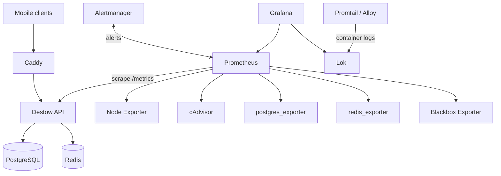
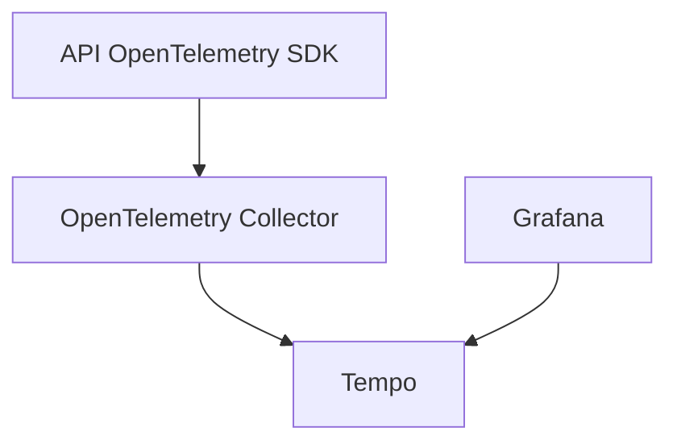

# Open-Source Observability For Destow

Destow already has the first piece of observability: the API exposes
Prometheus-format metrics at `GET /metrics` using `prom-client`.

This guide explains how to turn that into a full open-source observability stack
for a cheap VPS deployment.

## Implemented Files

This repo now includes deployable observability files under `apps/api`:

- `docker-compose.observability.yml`: Prometheus, Grafana, Alertmanager, Loki,
  Promtail, Node Exporter, cAdvisor, Postgres exporter, Redis exporter, and
  Blackbox Exporter.
- `observability/prometheus.local.yml`: local Docker scrape config.
- `observability/prometheus.vps.yml`: VPS production scrape config.
- `observability/alert-rules.yml`: starter Prometheus alert rules.
- `observability/alertmanager.yml`: starter Alertmanager routing.
- `observability/promtail.yml`: Docker log collection into Loki.
- `observability/blackbox.yml`: HTTP health-check probe module.
- `observability/grafana/provisioning/datasources/datasources.yml`: automatic
  Prometheus and Loki data sources.
- `.env.observability.example`: optional local/VPS environment overrides.

## Local Deploy

From the repo root:

```bash
make obs-up
```

This runs:

```bash
cd apps/api
docker compose -f docker-compose.yml -f docker-compose.observability.yml up -d
```

Local URLs:

- API: `http://localhost:3000/health`
- Grafana: `http://localhost:3001`
- Prometheus: `http://localhost:9090`

Default local Grafana credentials:

```text
admin / destow_admin_change_me
```

Change them by copying values from `apps/api/.env.observability.example` into
`apps/api/.env`.

Useful local commands:

```bash
make obs-ps
make obs-logs
make obs-down
```

On Docker Desktop, host/container exporters can be less complete than on a real
Linux VPS. The API metrics, Grafana, Prometheus, Loki, Postgres exporter, Redis
exporter, and Blackbox checks should still be the main local signal.

## VPS Deploy

Copy or keep these files on the VPS alongside the API Compose files:

```text
apps/api/docker-compose.observability.yml
apps/api/observability/
apps/api/.env.observability.example
```

Set production overrides in the VPS Compose env file:

```env
PROMETHEUS_CONFIG=./observability/prometheus.vps.yml
GRAFANA_ADMIN_USER=admin
GRAFANA_ADMIN_PASSWORD=<strong-password>
POSTGRES_EXPORTER_DATA_SOURCE_NAME=postgresql://destow:<db-password>@db:5432/destow?sslmode=disable
REDIS_EXPORTER_ADDR=redis://redis:6379
```

Then start the production stack with the observability add-on from `apps/api`:

```bash
docker compose \
  --env-file .env \
  -f docker-compose.yml \
  -f docker-compose.observability.yml \
  up -d
```

If your VPS uses a separate production Compose file, combine that file with
`docker-compose.observability.yml` from the same directory, or adjust the bind
mount paths for `./observability/...`.

Grafana and Prometheus are bound to `127.0.0.1` by default, so on a VPS use an
SSH tunnel:

```bash
ssh -L 3001:localhost:3001 -L 9090:localhost:9090 user@server
```

Then open:

- Grafana: `http://localhost:3001`
- Prometheus: `http://localhost:9090`

For public Grafana access, put it behind Caddy with HTTPS and basic auth. Do not
publicly expose Prometheus, Loki, Alertmanager, exporters, or API `/metrics`.

## Recommended Stack

Start with this:

| Need | Tool | Why |
| --- | --- | --- |
| Metrics scraping and storage | Prometheus | Standard, simple, already matches `/metrics` |
| Dashboards | Grafana | Best open-source UI for Prometheus/Loki/Tempo |
| Alerts | Alertmanager | Native Prometheus alert routing |
| Container logs | Loki + Promtail or Grafana Alloy | Cheap log storage, integrates cleanly with Grafana |
| Host metrics | Node Exporter | CPU, memory, disk, filesystem, network |
| Container metrics | cAdvisor | Per-container CPU, memory, network, restarts |
| PostgreSQL metrics | postgres_exporter | DB connections, locks, slow pressure signals |
| Redis metrics | redis_exporter | Redis memory, commands, connections, errors |
| HTTP uptime checks | Blackbox Exporter | External health checks for `/health` |

Add later:

| Need | Tool | When |
| --- | --- | --- |
| Distributed traces | OpenTelemetry + Tempo | When request flows become harder to debug |
| Error tracking | GlitchTip | When you want open-source Sentry-like issue tracking |
| Synthetic checks | Blackbox Exporter | Once public API endpoints are stable |

## Target Architecture



Keep Grafana, Prometheus, Loki, and exporters private. Expose Grafana only over
HTTPS with authentication, or keep it behind a VPN / SSH tunnel.

## What Destow Already Emits

From `apps/api/src/lib/metrics/metrics.ts`:

- `destow_http_requests_total`
- `destow_http_request_duration_seconds`
- default runtime/process metrics from `prom-client` with the `destow_` prefix

From `apps/api/src/middleware/metrics/metrics.ts`:

- every completed HTTP response is recorded
- labels are bounded: `method`, matched `route`, and `status`
- `/metrics` is skipped so scrapes do not inflate request counters

That is enough to build the first useful dashboard:

- request rate
- p95/p99 latency
- 4xx and 5xx rate
- endpoint-level latency
- process memory and CPU
- event loop lag

## MVP Observability Plan

### Phase 1: Metrics And Dashboards

Deploy:

- Prometheus
- Grafana
- Node Exporter
- cAdvisor

Scrape:

- `api:3000/metrics`
- node exporter
- cAdvisor

Dashboards:

- API RED dashboard: rate, errors, duration
- host dashboard: CPU, RAM, disk, network
- container dashboard: restarts, memory, CPU

### Phase 2: Logs

Deploy:

- Loki
- Promtail or Grafana Alloy

Collect:

- API container logs
- Caddy logs
- Postgres logs
- Redis logs

Use labels like:

- `service=api`
- `service=gateway`
- `service=postgres`
- `service=redis`
- `env=production`

### Phase 3: Alerts

Deploy:

- Alertmanager

Alert on:

- API down
- high 5xx rate
- high p95 latency
- disk almost full
- container restart loop
- Postgres unavailable
- Redis unavailable
- TLS endpoint health check failing

### Phase 4: Traces

Deploy later:

- OpenTelemetry SDK in the API
- OpenTelemetry Collector
- Tempo

Tracing is useful once there are more flows: bookings, payments, maps, provider
assignment, notifications, and real-time tracking. It is optional for the first
deployment.

## Docker Compose Add-On

The checked-in add-on lives next to the API Compose file:

```text
apps/api/
|-- docker-compose.yml
|-- docker-compose.observability.yml
|-- .env.observability.example
|-- observability/
|   |-- prometheus.local.yml
|   |-- prometheus.vps.yml
|   |-- alert-rules.yml
|   |-- alertmanager.yml
|   |-- blackbox.yml
|   |-- promtail.yml
|   +-- grafana/provisioning/datasources/datasources.yml
```

Run it locally with:

```bash
make obs-up
```

Or directly from `apps/api`:

```bash
docker compose -f docker-compose.yml -f docker-compose.observability.yml up -d
```

The actual `apps/api/docker-compose.observability.yml` includes:

```yaml
services:
  prometheus:
    # scrapes API, host, container, Postgres, Redis, and Blackbox targets
  alertmanager:
    # receives Prometheus alerts
  grafana:
    # dashboards, bound to 127.0.0.1:3001 by default
  loki:
    # log storage
  promtail:
    # Docker log collector
  node-exporter:
    # host metrics
  cadvisor:
    # container metrics
  postgres-exporter:
    # PostgreSQL metrics
  redis-exporter:
    # Redis metrics
  blackbox-exporter:
    # HTTP health probes
```

## Prometheus Config

Example `observability/prometheus.yml`:

```yaml
global:
  scrape_interval: 15s
  evaluation_interval: 15s

rule_files:
  - /etc/prometheus/alert-rules.yml

alerting:
  alertmanagers:
    - static_configs:
        - targets:
            - alertmanager:9093

scrape_configs:
  - job_name: destow-api
    metrics_path: /metrics
    static_configs:
      - targets:
          - api:3000

  - job_name: node
    static_configs:
      - targets:
          - node-exporter:9100

  - job_name: cadvisor
    static_configs:
      - targets:
          - cadvisor:8080

  - job_name: postgres
    static_configs:
      - targets:
          - postgres-exporter:9187

  - job_name: redis
    static_configs:
      - targets:
          - redis-exporter:9121

  - job_name: api-health
    metrics_path: /probe
    params:
      module: [http_2xx]
    static_configs:
      - targets:
          - https://api.destow.com/health
    relabel_configs:
      - source_labels: [__address__]
        target_label: __param_target
      - source_labels: [__param_target]
        target_label: instance
      - target_label: __address__
        replacement: blackbox-exporter:9115
```

## Alert Rules

Example `observability/alert-rules.yml`:

```yaml
groups:
  - name: destow-api
    rules:
      - alert: DestowApiDown
        expr: up{job="destow-api"} == 0
        for: 1m
        labels:
          severity: critical
        annotations:
          summary: Destow API metrics target is down

      - alert: DestowHighErrorRate
        expr: |
          sum(rate(destow_http_requests_total{status=~"5.."}[5m]))
          /
          clamp_min(sum(rate(destow_http_requests_total[5m])), 1)
          > 0.02
        for: 5m
        labels:
          severity: warning
        annotations:
          summary: Destow API 5xx rate is above 2%

      - alert: DestowHighLatencyP95
        expr: |
          histogram_quantile(
            0.95,
            sum(rate(destow_http_request_duration_seconds_bucket[5m])) by (le)
          ) > 1
        for: 10m
        labels:
          severity: warning
        annotations:
          summary: Destow API p95 latency is above 1 second

  - name: host
    rules:
      - alert: HostDiskAlmostFull
        expr: |
          (node_filesystem_avail_bytes{fstype!~"tmpfs|overlay"}
          / node_filesystem_size_bytes{fstype!~"tmpfs|overlay"}) < 0.15
        for: 10m
        labels:
          severity: warning
        annotations:
          summary: Host disk has less than 15% free space

      - alert: ContainerRestarting
        expr: increase(container_start_time_seconds{name!=""}[10m]) > 2
        for: 5m
        labels:
          severity: warning
        annotations:
          summary: A container appears to be restarting repeatedly
```

## Alertmanager Config

Start with a quiet config if you have not chosen Slack, email, or PagerDuty yet:

```yaml
route:
  receiver: default
  group_by: ["alertname", "service"]
  group_wait: 30s
  group_interval: 5m
  repeat_interval: 4h

receivers:
  - name: default
```

Then add one real receiver. For a lean team, Slack or email is usually enough.

## Log Collection

Example `observability/promtail.yml`:

```yaml
server:
  http_listen_port: 9080
  grpc_listen_port: 0

positions:
  filename: /tmp/positions.yaml

clients:
  - url: http://loki:3100/loki/api/v1/push

scrape_configs:
  - job_name: docker
    docker_sd_configs:
      - host: unix:///var/run/docker.sock
        refresh_interval: 5s
    relabel_configs:
      - source_labels: ["__meta_docker_container_name"]
        regex: "/(.*)"
        target_label: "container"
      - source_labels: ["__meta_docker_container_label_com_docker_compose_service"]
        target_label: "service"
      - target_label: "env"
        replacement: "production"
```

This collects stdout/stderr from containers. That matches the current API,
because it logs through `console.log`, `console.warn`, and `console.error`.

## Grafana Setup

Add data sources:

- Prometheus: `http://prometheus:9090`
- Loki: `http://loki:3100`

Create dashboards:

- API Overview
- Host Overview
- Docker Containers
- PostgreSQL
- Redis
- Logs Explorer

Useful PromQL panels:

```promql
sum(rate(destow_http_requests_total[5m]))
```

```promql
sum(rate(destow_http_requests_total{status=~"5.."}[5m]))
/
clamp_min(sum(rate(destow_http_requests_total[5m])), 1)
```

```promql
histogram_quantile(
  0.95,
  sum(rate(destow_http_request_duration_seconds_bucket[5m])) by (le)
)
```

```promql
sum by (route, method) (rate(destow_http_requests_total[5m]))
```

```promql
histogram_quantile(
  0.95,
  sum(rate(destow_http_request_duration_seconds_bucket[5m])) by (le, route)
)
```

## Protecting Observability

Do not expose Prometheus, Loki, Alertmanager, exporters, or `/metrics` publicly.

Recommended options:

- Keep all observability services on the Docker network only.
- Access Grafana through an SSH tunnel:

```bash
ssh -L 3001:localhost:3001 user@server
```

- Or expose Grafana through Caddy with HTTPS and strong auth.
- Keep `/metrics` blocked at public Caddy, as shown in `deployment.md`.

If exposing Grafana through Caddy, bind Grafana internally and reverse proxy it:

```caddyfile
monitor.destow.com {
  encode gzip
  basicauth {
    admin <hashed-password>
  }
  reverse_proxy grafana:3000
}
```

Generate the Caddy password hash on the server:

```bash
docker run --rm caddy:2-alpine caddy hash-password --plaintext '<strong-password>'
```

## API Improvements To Add Later

The current API metrics are a solid start. Add these next:

- structured JSON logging with request id, user id when safe, route, status,
  latency, and error code
- request id middleware and `X-Request-Id` response header
- domain metrics:
  - OTP requested / verified / failed
  - login success / failure
  - refresh reuse detected
  - booking created / cancelled
  - payment success / failure
  - provider assignment latency
- database query timing around hot paths
- Redis failure counters
- SMS provider failure counters

Keep labels low-cardinality. Good labels:

- `route`
- `method`
- `status`
- `provider`
- `result`

Avoid labels like:

- user id
- phone number
- booking id
- raw URL
- IP address

## Optional Tracing With OpenTelemetry

Add tracing only after metrics and logs are stable.

Recommended shape:



Trace important spans:

- HTTP request
- auth service calls
- Postgres queries
- Redis checks
- SMS provider calls
- payment provider calls
- maps provider calls

Sampling:

- sample 100% in staging
- sample 1-10% in production
- always sample errors if possible

## Minimum Production Checklist

For the first VPS production deployment:

- API `/metrics` works internally.
- Prometheus scrapes API, host, container, Postgres, and Redis metrics.
- Grafana has API, host, container, DB, and Redis dashboards.
- Loki receives API and gateway logs.
- Alerts fire for API down, high 5xx, high latency, and disk pressure.
- `/metrics`, Prometheus, Loki, and exporters are not public.
- Grafana is protected or available only through SSH/VPN.

## Good First Implementation Order

1. Add `docker-compose.observability.yml`.
2. Add Prometheus config and scrape `api:3000/metrics`.
3. Add Grafana and build the API overview dashboard.
4. Add node exporter and cAdvisor.
5. Add Loki + Promtail for logs.
6. Add Postgres and Redis exporters.
7. Add Alertmanager rules.
8. Add structured app logging.
9. Add OpenTelemetry traces only when needed.
